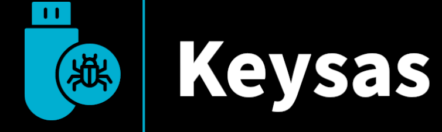
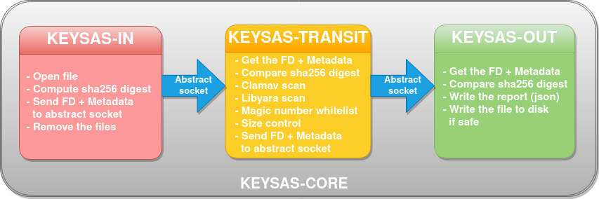

<div align="center">

</div>

# USB virus cleaning station

# Main features

- Retrieve untrusted files from USB (via keysas-io) or over the network
- Perform multiple checks
  - Run anti-virus check (ClamAV)
  - Run Yara parsing
  - Run extensions and size checks
- Signatures (for scanned files and USB keys)
    - Trusted (Outgoing) USB devices must be signed with Keysas-admin application
    - Each verified file signature is stored in the corresponding file report (.krp) 
    - Signatures are post-quantum proof (hybrid Ed25519/Diltithium5 scheme)
    - Private keys are stored using PKCS#8 format
    - x509 certificates are signed by the internal PKI (using Keysas-admin)
- Authentication
  - Users can be authenticated using personal Yubikeys 5

# Keysas-core

## Architecture

<div align="center">

</div>

Files are passed between daemons as raw file descriptors and using abstract sockets (GNU/Linux only). Each daemon adds metadata and sends it to the next daemon using a dedicated abstract socket. Finally, the last daemon (Keysas-out) chooses whether or not to write the file to the output directory according to the corresponding metadata. For each file, a report is systematically created in the output directory (sas_out).

 - Daemons are running under unprivileged users
 - Daemons are sandboxed using systemd (Security drop-in)
 - Daemons are sandboxed using LandLock
 - Daemons are sandboxed using Seccomp (x86_64 & aarch64)

## Other binaries or applications available

 - Keysas-admin: Desktop application for remotly managing several Keysas stations (Tauri application). It also provides an hybrid post-quantum PKI to sign USB outgoing devices, sign certificat signing requests (csr) from Keysas stations.
 - Keysas-io: Daemon watching udev events to verify the signature of any mass storage USB devices and mount it as a IN (no or invalid signature) or OUT device (valid signature).
 - Keysas-sign: Command line utility to import PEM certificate via Keysas-admin
 - Keysas-fido: Command line utility to manage Yubikeys 5 enrollment
 - Keysas-backend: Create a websocket server to send different json values to the keysas-frontend
 - Keysas-frontend: Readonly Vue.js Frontend for the final user
 - Keysas-firewall (WIP): Provide a Windows 10 application to verify that documents have been signed by a Keysas station. 

## Build && Installation

On Debian stable (Bookwoom only):

```bash
apt -qy install -y libyara-dev libyara9 wget cmake make lsb-release software-properties-common libseccomp-dev clamav-daemon clamav-freshclam pkg-config git bash libudev-dev libwebkit2gtk-4.0-dev build-essential curl wget libssl-dev libgtk-3-dev libayatana-appindicator3-dev librsvg2-dev
bash -c "$(wget -O - https://apt.llvm.org/llvm.sh)"
curl https://sh.rustup.rs -sSf | sh -s -- --default-toolchain nightly -y
source "$HOME/.cargo/env"
git clone --depth=1 https://github.com/r3dlight/keysas && cd keysas
rustup default nightly
make help
make build
make install
```

## User documentation

User documentation can be found here : [https://keysas.fr](https://keysas.fr)
